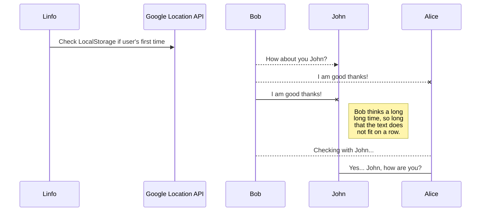
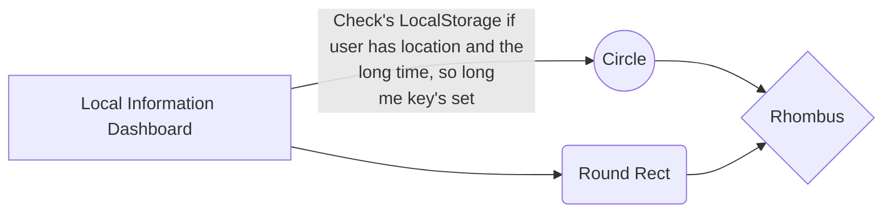

# Local Information Dashboard

Local Information Dashboard is a single-page website to gather news and weather for your location based on user input. This was originally a group project for a coding bootcamp with [DigitalCrafts](https://www.digitalcrafts.com/).

## Developer Team

[Nick Bess](https://github.com/NBESS)
[Jonathan Cox](https://github.com/jonathancox1)
[David Foster](https://github.com/dlfosterii)
[Nicholas Nam](https://github.com/n1ckDotEXE)

### Netlify Link

https://wizardly-khorana-147bb3.netlify.app/

## Contributing
Pull requests are welcome. For major changes, please open an issue first to discuss what you would like to change.

Please make sure to update tests as appropriate.

## Integrated API's

Linfo directly utilizes 2 API's in it's code as a foundation for the website. 
|API               |Website|                                                  
|----------------|-------------------------------|
|Google Maps|developers.google.com/places|
|GNews|gnews.io|
- **Google Places API** - The Google Places API is the foundation to the Linfo dashboard. When a user visits the website for the first time, they are prompted to enter their location. Google Places deciphers the input and returns the closest match. The Linfo website extracts the relevant values and is stored into the browser's Local Storage.

## Integrated Widgets

|Widget               |Website            |                                       
|----------------|-------------------------------|
|Google Calendar|calendar.google.com|
|Climacell Weather|climacell.co|

## API Usage
You can render UML diagrams using [Mermaid](https://mermaidjs.github.io/). For example, this will produce a sequence diagram:

And this will produce a flow chart:

## License

[GPL-3.0-or-later](https://spdx.org/licenses/GPL-3.0-or-later.html)

